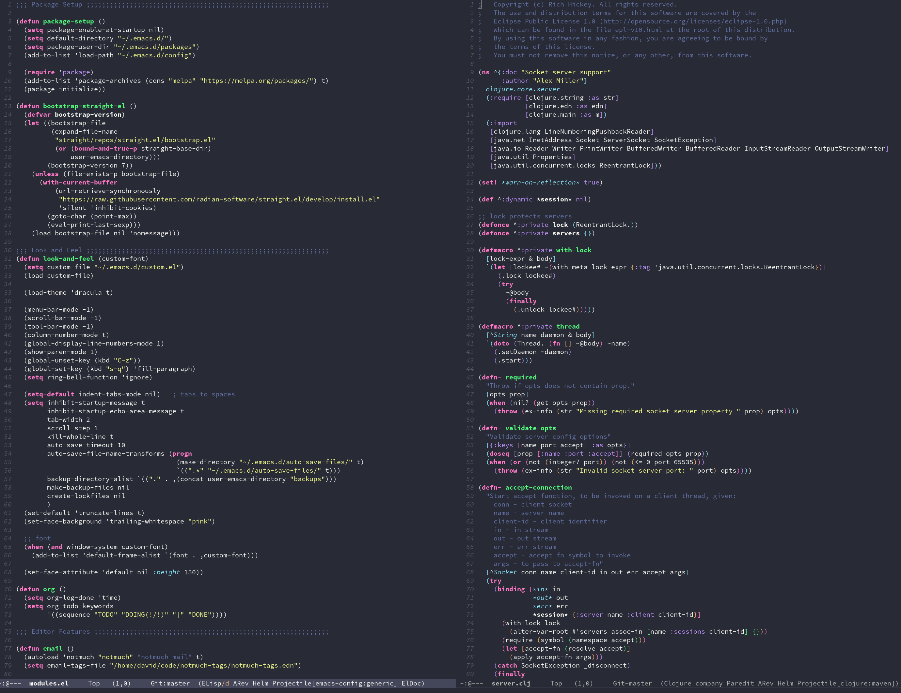

## Emacs configuration files

This is my current emacs configuration - it's a simple system that
supports multiple "installations" from different machines.

### Some packages that are installed

* `projectile`
* `helm`
* `dracula-theme`
* `paredit`
* `magit`
* `treemacs`
* `company-mode`

## Setup

### Option 1: use the default installation
1. Copy the example init file:
  ```sh
  $ cp init.example.el init.el
  ```

### Option 2: make your own
1. Copy an existing file in the `installations` directory and tweak
   it.

2. Load that installation from the `init.el` file.
  ```elisp
  (load "~/.emacs.d/installations/your-installation.el")
  ```

## Background

The way it works is that `modules.el` defines a bunch of functions for
different bits of functionality (e.g. clojure-mode and key bindings)
without explicitly executing them.

Then each machine has a script in the "installations" folder that
simply calls the functions that it wants to load.

What's nice about this design is that the functions can have regular
parameters for cases where machines differ - for example, on mac I
might have different fonts installed.

Also, I have found that I work with different programming languages at
work and home, so being able to pick and choose which ones I actually
load makes startup faster and less cluttered.



