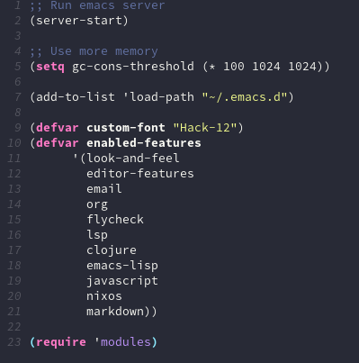

## Emacs configuration files

This is my current emacs configuration - it's a simple system that
supports multiple "installations" from different machines.

### Some packages that are available

* `projectile`
* `helm`
* `dracula-theme`
* `paredit`
* `magit`
* `treemacs`
* `company-mode`
* `gptel` (LLM integration)
* `inkling` (Intelligent code suggestions with LLMs)

## Setup

### Option 1: use the default installation
1. Copy the example init file:
  ```sh
  $ cp init.example.el init.el
  ```

### Option 2: make your own
1. Copy an existing file in the `installations` directory and tweak
   it.

2. Load that installation from the `init.el` file.
  ```elisp
  (load "~/.emacs.d/installations/your-installation.el")
  ```

## Background

The way it works is that `modules.el` defines a bunch of macros for
different bits of functionality (e.g. clojure-mode and key bindings)
without explicitly executing them.

Then each machine has a script in the "installations" folder that
includes all the features it wants to use.

The reason they are macros is because `use-package` wants to run at
the top-level, so you can't just run it within a regular function. So
these macros essentially check if the given feature is enabled, and
execute the body of the feature at the top level if so. That way, the
features that are included actually execute at macroexpansion time.



## Testing

This configuration includes automated tests. You can run the tests using:

```sh
make test            # Run all tests
make test-inkling    # Test just the inkling package
make lint            # Check Emacs Lisp syntax
```

### Inkling Mode

The `inkling` package provides intelligent LLM code suggestions in Emacs:

- Real-time LLM suggestions as you edit code
- Automatic error fixing using LSP diagnostics
- Popups showing code suggestions (or optional inline display)
- Tab-based navigation between suggestions
- Company-mode integration

#### Usage:

- Enable with `M-x inkling-mode` or the global keybinding `C-c C-a`
- After a short idle delay, suggestions will appear near your cursor
- Use `TAB` to navigate between suggestions
- Press `ENTER` to accept a suggestion
- Press `C-g` to dismiss all suggestions

#### Logging and Costs:

Inkling includes detailed logging and cost tracking for LLM usage:

- `M-x inkling-display-statistics` - View token usage and cost statistics
- `M-x inkling-open-log` - View detailed log of all LLM interactions
- `M-x inkling-clear-log` - Clear the log file
- `M-x inkling-reset-statistics` - Reset usage statistics
- `M-x inkling-use-backend` - Switch between different LLM backends
